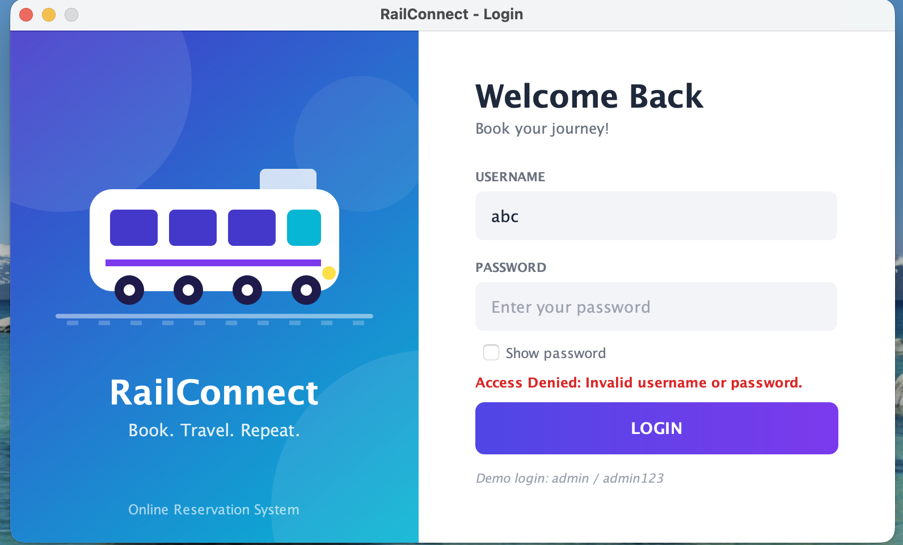
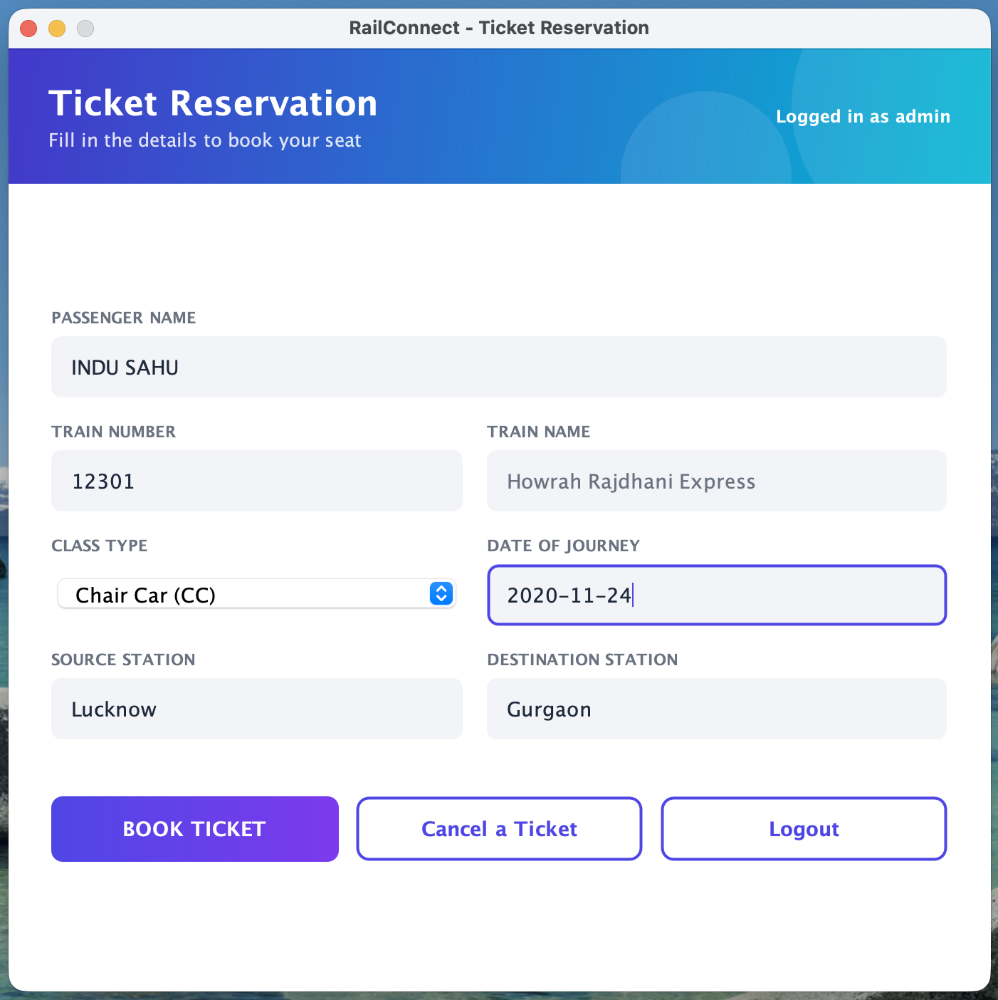
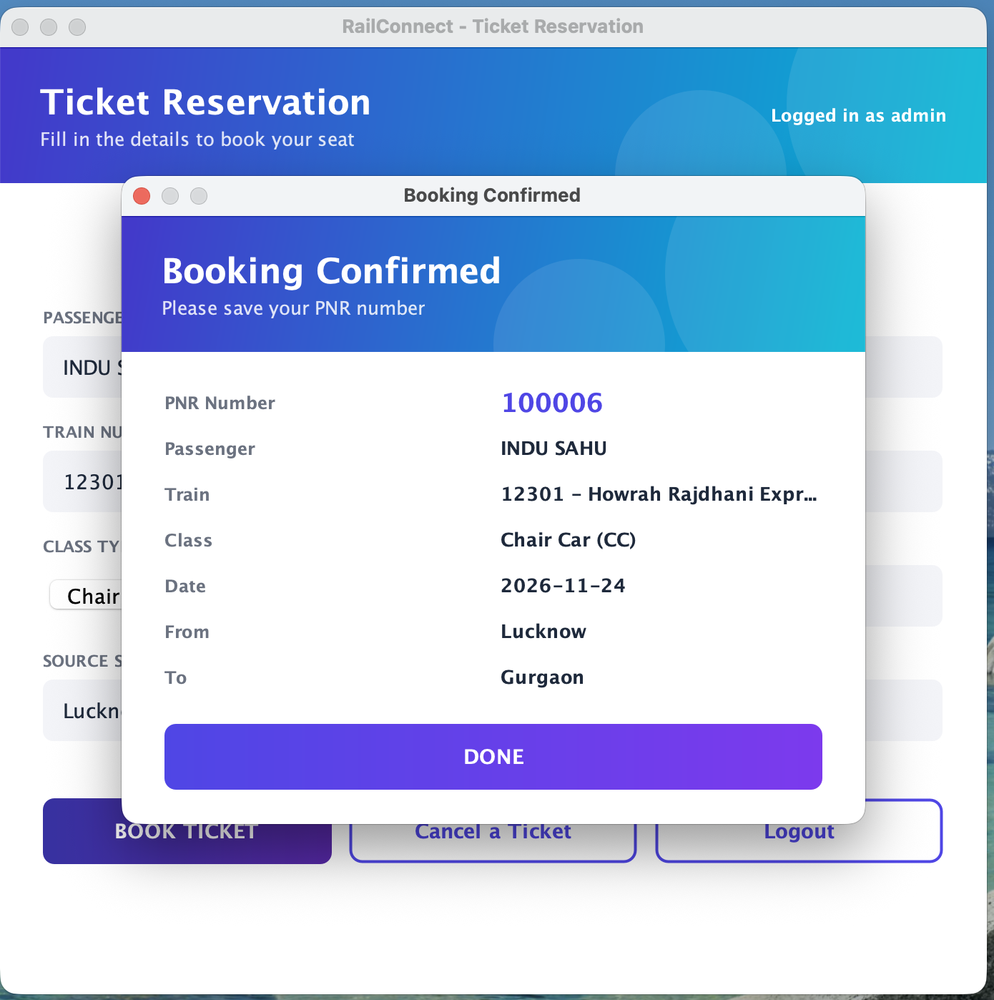
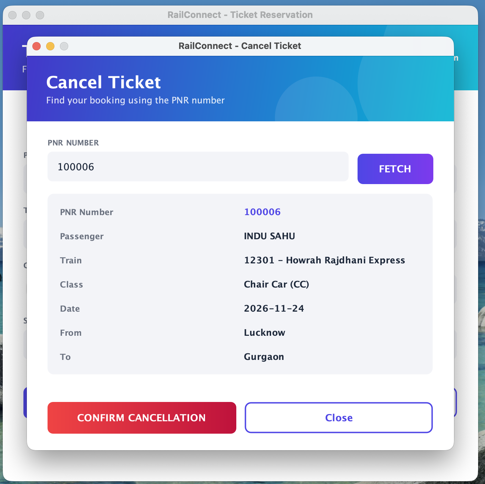
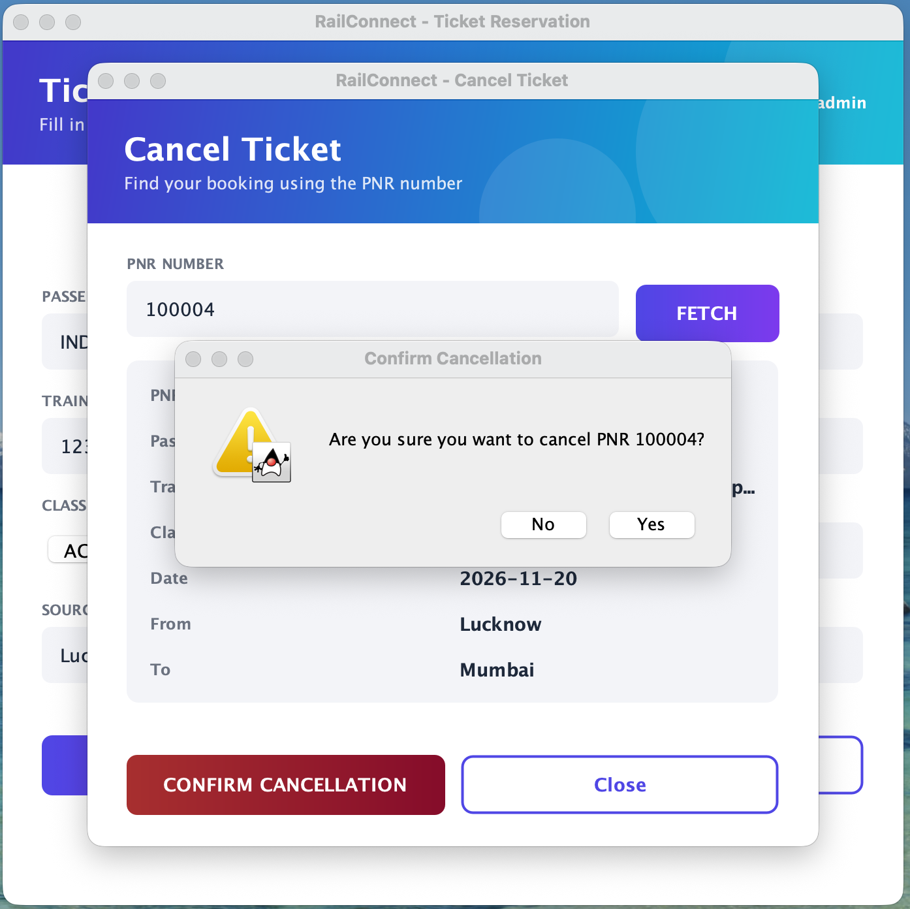
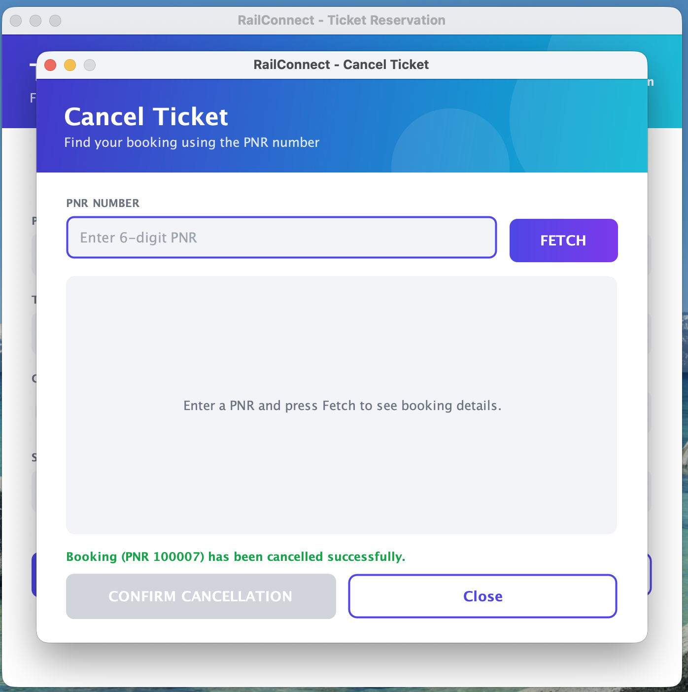

# Online Reservation System (Java GUI Application)

**Intern:** INDU SAHU
**Track:** Java Development
**Task:** Task 1 - Online Reservation System
**Internship:** Oasis Infobyte (OIBSIP)

## About the Project
RailConnect is a GUI-based train reservation system built in Java using Swing,
JDBC and SQLite. Users log in, book train tickets (a unique PNR is generated
for every booking) and cancel bookings using the PNR number.

## Features
- Login form with username and password (access denied for invalid credentials)
- Reservation form with passenger name, train number, train name
  (auto-filled from train number), class type, date of journey, source and destination
- Book button saves the reservation to the database and generates a unique PNR
- Ticket-style confirmation popup showing all booking details
- Cancellation form: enter PNR, fetch full booking details
- "Are you sure?" confirmation dialog before the booking is deleted from the database
- Input validation: no empty fields, numeric train number, valid date format,
  no past dates, source and destination must differ
- **Extra:** Modern split-screen login with show-password option and shake animation on wrong login
- **Extra:** Logout option, inline error messages and a custom-styled UI theme

## Project Structure
| Class | Responsibility |
|---|---|
| `Main` | Entry point; initializes the database and opens the login screen |
| `DatabaseHelper` | Creates tables, sample users and trains; handles login, booking, fetch and cancel |
| `LoginForm` | Login screen and custom styled components |
| `ReservationForm` | Ticket booking form with validation |
| `CancellationForm` | Fetch booking by PNR and cancel it |
| `Theme` | Shared styling: header, buttons, cards and the ticket popup |

## Concepts Used
- Java Swing for GUI (`JFrame`, `JDialog`, `JComboBox`, custom painting with Java2D)
- JDBC with SQLite for data storage
- `PreparedStatement` everywhere (prevents SQL injection)
- Event handling with listeners (`ActionListener`, `DocumentListener`)
- Input validation with `LocalDate` parsing and regular expressions
- Object-Oriented Programming (separate classes for UI and database)

## How to Run
1. Install JDK 17 or higher.
2. Clone this repository.
3. Open the `Java-Task1-OnlineReservationSystem` folder in IntelliJ IDEA.
4. Add the jars in `lib/` as a library (right-click `lib`, then Add as Library).
5. Run `Main.java`.

Or from the terminal, inside the project folder:

```
# Mac/Linux
javac -cp "lib/*" -d out src/*.java
java -cp "out:lib/*" Main

# Windows
javac -cp "lib/*" -d out src/*.java
java -cp "out;lib/*" Main
```

The database file `reservation.db` is created automatically on the first run.

## Test Credentials
| Username | Password |
|---|---|
| admin | admin123 |
| user | user123 |

## Sample Train Numbers
| Train No | Train Name |
|---|---|
| 12301 | Howrah Rajdhani Express |
| 12951 | Mumbai Rajdhani Express |
| 12002 | Bhopal Shatabdi Express |
| 12260 | Sealdah Duronto Express |
| 12009 | Shatabdi Express |
| 22416 | Vande Bharat Express |

## Screenshots

### Login (Access Denied for wrong credentials)


### Reservation Form


### Booking Confirmation with PNR


### Cancellation: Fetch Booking by PNR


### Cancellation: "Are you sure?" Dialog


### Cancellation Successful


## Sample Flow
```
1. Login with admin / admin123
2. Enter train number 12301 -> train name auto-fills "Howrah Rajdhani Express"
3. Fill name, class, date (yyyy-MM-dd), source, destination
4. Click BOOK TICKET -> confirmation popup shows PNR (e.g. 100004)
5. Click "Cancel a Ticket" -> enter PNR -> FETCH -> booking details appear
6. Click CONFIRM CANCELLATION -> "Are you sure?" -> Yes
7. Fetch the same PNR again -> "No booking found for this PNR."
```