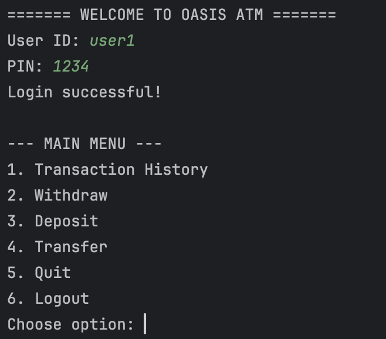
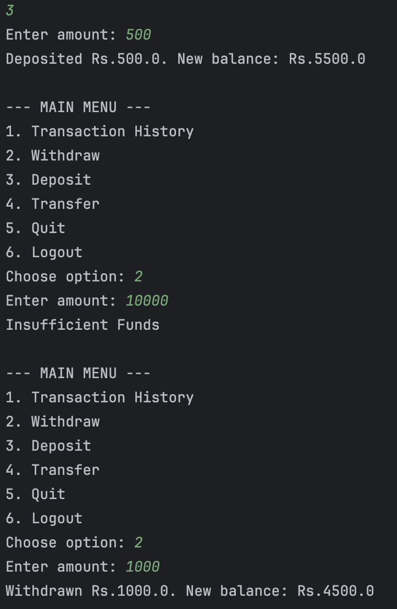
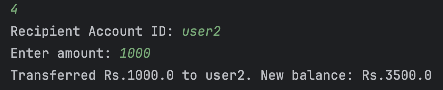
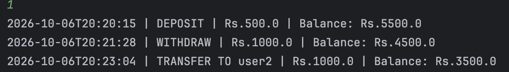
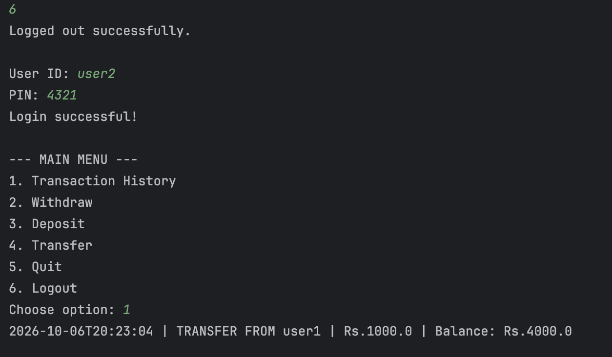
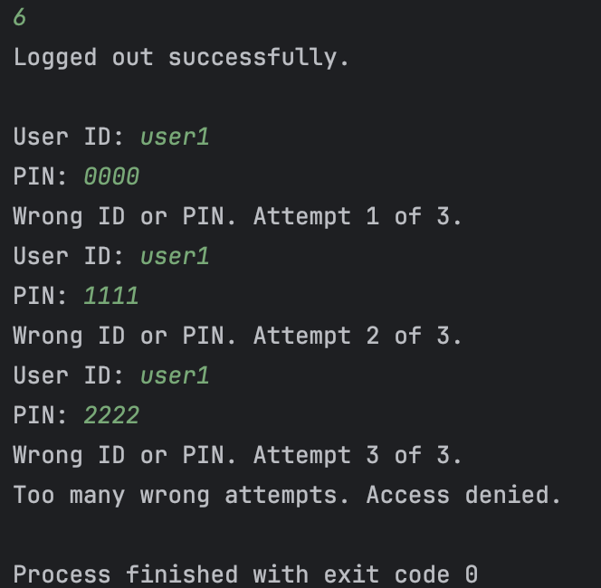

# ATM Interface (Java Console Application)

**Intern:** INDU SAHU
**Track:** Java Development
**Task:** Task 3 - ATM Interface
**Internship:** Oasis Infobyte (OIBSIP)

## About the Project
A console-based ATM simulation built in Java using Object-Oriented Programming.
Users log in with a User ID and PIN, then perform banking operations through a menu.

## Features
- Login with User ID and PIN (access denied after 3 wrong attempts)
- Transaction History (timestamped log of all transactions)
- Withdraw (with balance validation, shows "Insufficient Funds")
- Deposit
- Transfer to another account (both accounts updated and logged as
  `TRANSFER TO` / `TRANSFER FROM`)
- Quit
- **Extra:** Logout option, so another user can log in during the same run
- Input validation (rejects text, zero and negative amounts)

## Project Structure
| Class | Responsibility |
|---|---|
| `Main` | Entry point; creates the bank and sample accounts |
| `Bank` | Stores all accounts, handles login and transfers |
| `Account` | Holds user ID, PIN, balance and transaction list |
| `Transaction` | One transaction record (type, amount, time, balance) |
| `ATM` | Menu and user interaction |

## Concepts Used
- Encapsulation (private fields with getters)
- `ArrayList` for transaction history
- `HashMap` for storing accounts
- `switch` for the menu
- Exception handling (`try/catch`) for invalid input

## How to Run
1. Install JDK 17 or higher.
2. Clone this repository.
3. Open the `Java-Task3-ATMInterface` folder in IntelliJ IDEA.
4. Run `Main.java`.

## Test Accounts
| User ID | PIN | Starting Balance |
|---|---|---|
| user1 | 1234 | Rs.5000 |
| user2 | 4321 | Rs.3000 |

## Screenshots

### Login


### Deposit and Withdraw


### Transfer


### Transaction History


### Logout and Receiver History


### Wrong PIN (Access Denied)


## Sample Output
*(Repeated menu lines trimmed for brevity)*

```
===== WELCOME TO OASIS ATM =====
User ID: user2
PIN: 4321
Login successful!

--- MAIN MENU ---
1. Transaction History
2. Withdraw
3. Deposit
4. Transfer
5. Quit
6. Logout
Choose option: 4
Recipient Account ID: user1
Enter amount: 500
Transferred Rs.500.0 to user1. New balance: Rs.2500.0

Choose option: 6
Logged out successfully.

User ID: user1
PIN: 1234
Login successful!

Choose option: 1
2026-10-06T19:22:50 | TRANSFER FROM user2 | Rs.500.0 | Balance: Rs.5500.0
```